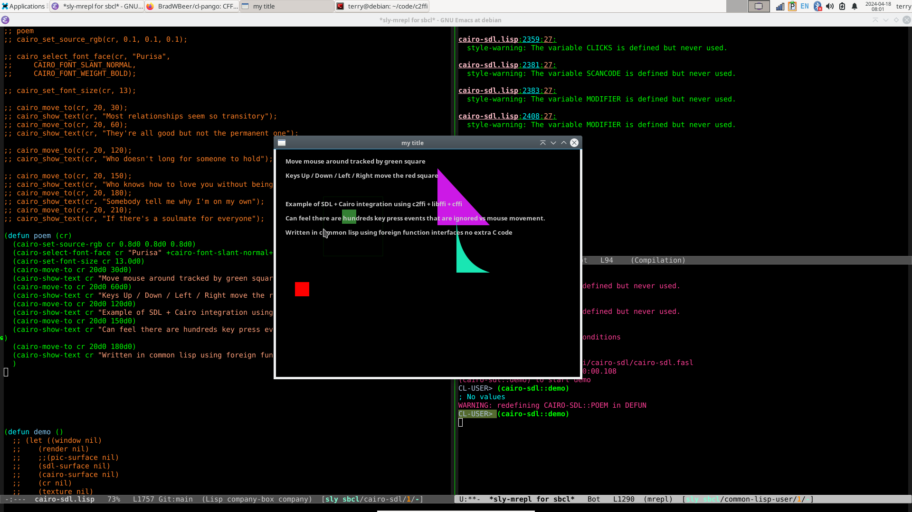
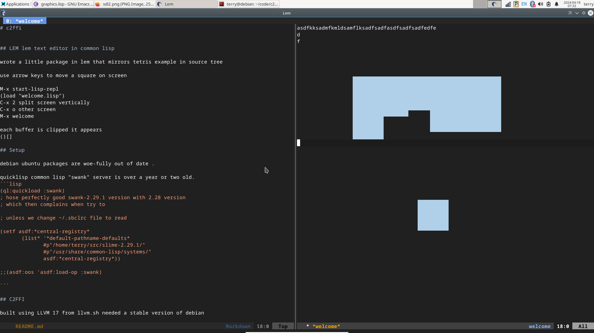

# c2ffi

## cairo - sdl2 - common lisp 

here is version use common lisp + c2ffi to generate relevant procedure bindings

actually can write most of it without an automated scripting c2ffi to extract clang llvm 
headers and struct information from c files / header files

nice experiment to see what it takes to get something off the ground

really want a back end that suffers details of graphics , front end simply 
says 

2 dimensional graphics protocol 

clear-buffer
draw-rectangle filled orange 
draw-lines
present-buffer

...





## LEM lem text editor in common lisp

wrote a little package in lem that mirrors tetris example in source tree

use arrow keys to move a square on screen

M-x start-lisp-repl
(load "welcome.lisp")
C-x 2 split screen vertically
C-x o other screen
M-x welcome 

each buffer is clipped it appears 



## Setup 

debian ubuntu packages are woe-fully out of date .

quicklisp common lisp "swank" server is over a year or two old. 
```lisp
(ql:quickload :swank) 
; hose perfectly good swank-2.29.1 version with 2.28 version
; which then complains when try to 

; unless we change ~/.sbclrc file to read 

(setf asdf:*central-registry*
       (list* '*default-pathname-defaults*
              #p"/home/terry/src/slime-2.29.1/"
              #p"/usr/share/common-lisp/systems/"
              asdf:*central-registry*))

;;(asdf:oos 'asdf:load-op :swank)

```

## C2FFI 

built using LLVM 17 from llvm.sh needed a stable version of debian 

achieved using a chroot environment and downloading entire distribution just to build c2ffi

## SDL2 FFI Libraries

| spec |   package |    include-header-location              |       shared-library-location |
| ---  | ---       | ---                                     |  ---                                        |
| spec |   SDL2    |    /usr/include/SDL2/                   |       /usr/lib/x86_64-linux-gnu/              |
| ---  | ---       | ---                                     |  ---                                        |
| [X] | sdl2       |   SDL.h                                 |    libSDL2.so |
| [X] | sdl2-image |   SDL_image.h                           |    libSDL2_image.so |
| [X] | sdl2-mixer |   SDL_mixer.h                           |    libSDL2_mixer.so |
| [X] | sdl2-ttf   |   SDL_ttf.h                             |    libSDL2_ttf.so |
| [X] | sdl2-net   |   SDL_net.h                             |     libSDL2_net.so |
| [X] | sdl2-gfx   |   SDL2_gfxPrimitives.h                  |   libSDL2_gfx.so |


