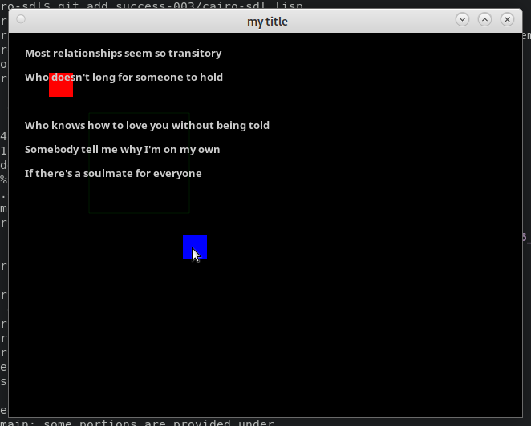

# cairo-sdl

mouse up / down , mouse motion , key press up down detection , rectangles , text 




need to do a simple c program to see how to do SDL stuff and CAIRO stuff together simplest possible.


## debugging a lisp -> c program is painful

slime server will crash every time c program crashes

can we even do step debugging using slime ? how ?


```lisp
> (ql:quickload #:quickproject)

> (quickproject:make-project "/home/terry/code/c2ffi/cairo-sdl/" :depends-on '(uiop cffi))
"cairo-sdl"
```


### _Your Name <your.name@example.com>_

This is a project to do ... something.

## License

Specify license here

