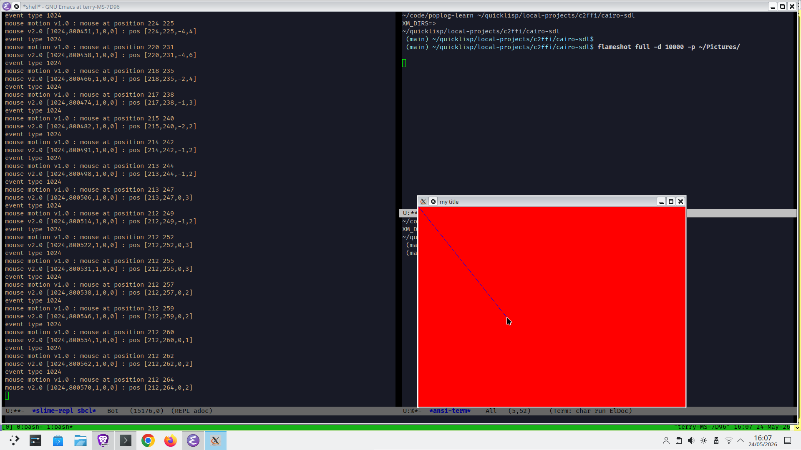
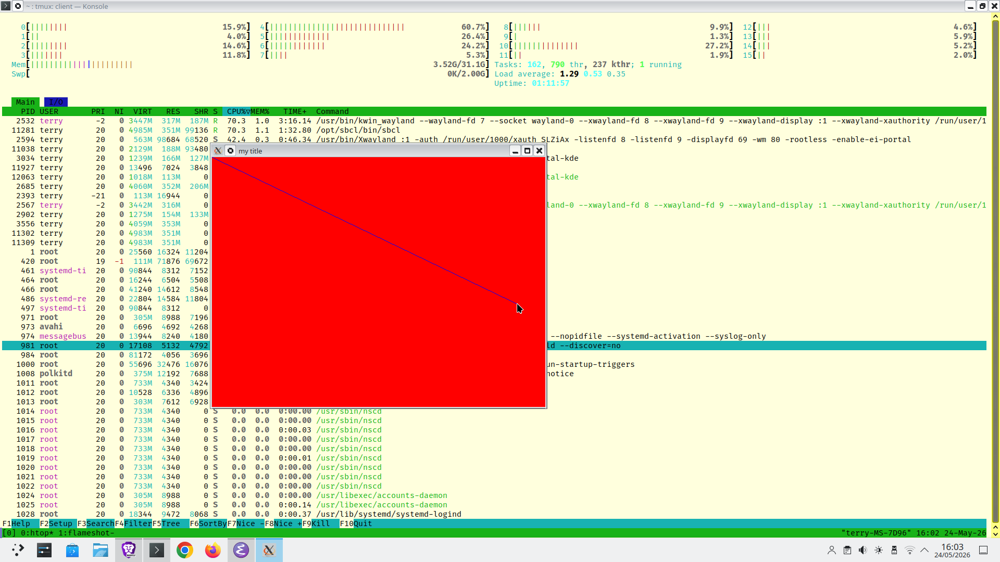
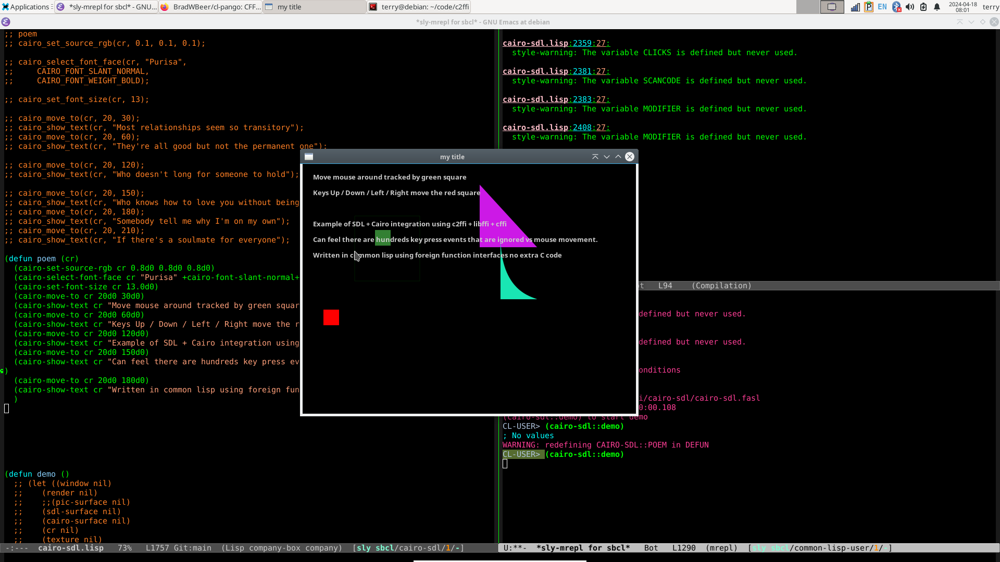
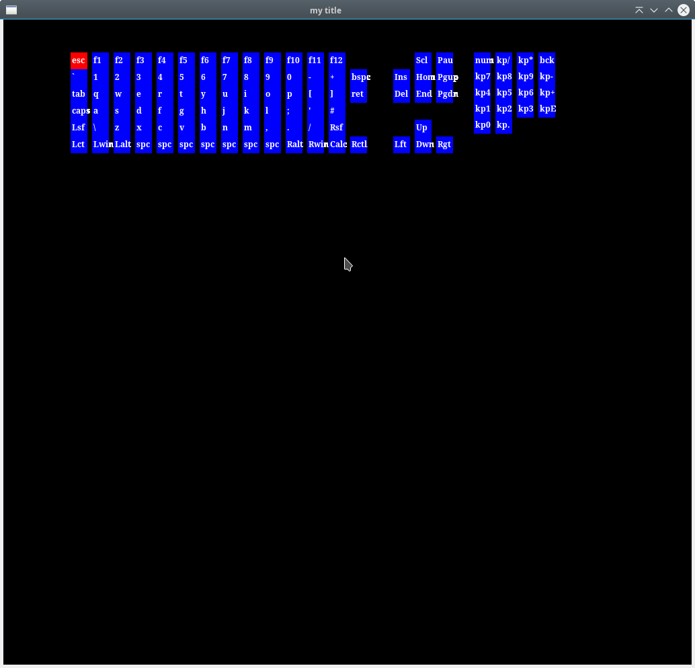

# cairo-sdl

## installation 

just put entire git repository into quicklisp/local-projects 
was ~/.quicklisp/local-projects
but now is ~/quicklisp/local-projects ....

# demos 

## basic.lisp 




- red screen move mouse and line from 0,0 to mouse-x,y 
- looks like all key events are being recorded also SDL_SCANCODE_COMMA etc..

(load "basic.lisp")
(in-package :temp)
(demo)


mouse up / down , mouse motion , key press up down detection , rectangles , text 




here is a keyboard scancode sdl example in common lisp




need to do a simple c program to see how to do SDL stuff and CAIRO stuff together simplest possible.

## cairo-sdl setup 

this places a symbolic link to actual cairo-sdl in code directory

```bash
	ln -sv /home/terry/code/c2ffi/cairo-sdl/cairo-sdl.asd /home/terry/quicklisp/local-projects/cairo-sdl.asd 
```

```lisp
> rlwrap sbcl

(ql:quickload :cairo-sdl)
(cairo-sdl::demo)
```

## debugging a lisp -> c program is painful

slime server will crash every time c program crashes

can we even do step debugging using slime ? how ?


```lisp
> (ql:quickload #:quickproject)

> (quickproject:make-project "/home/terry/code/c2ffi/cairo-sdl/" :depends-on '(uiop cffi))
"cairo-sdl"
```


### _Your Name <your.name@example.com>_

This is a project to do ... something.

## License

Specify license here

